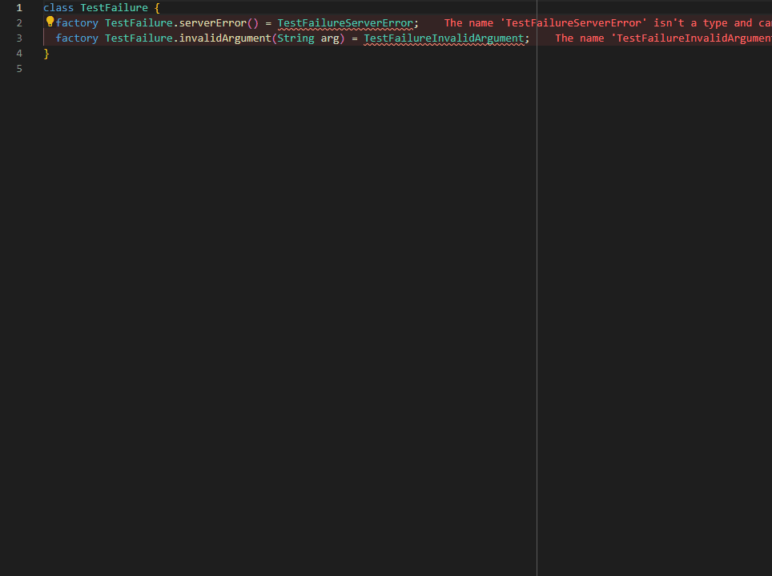

# Union Generator

## What inspired us?

We've been really happy using [freezed](https://pub.dev/packages/freezed) package tool to create our **union** classes, which have given us the possibility of having a better solution than common _enums_, providing methods like **map**, **when**, **maybeMap** and **maybeWhen** that allowed us to avoid omissions when working with different possible enumerated values for an instance.

So, what's the problem? Well... Freezed package creates auto-generated code and this, of course, makes stuff to be impossible to control, while adds some extra dependencies that we wanted to avoid at all.

Now, we're going to explain how to use the extension, so you can have full control on your code while easily having all the advantajes that **unions** give us.



## Usage

This extension works by creating a _template_ class that will help us know what to generate next. The expected structure is as follows:

```dart
class YourClassName{
    const factory YourClassName.firstUseCase() = NameForFirstUseCaseClass;
    const factory YourClassName.secondUseCase(String arg1, int arg2, bool arg 3) = NameForSecondUseCaseClass;
    const factory YourClassName.thirdUseCase(String arg1) = NameForThirdUseCaseClass;
}
```

This example will generate a type **YourClassName** which can be of any of these subtypes:

**NameForFirstUseCaseClass** || **NameForSecondUseCaseClass** || **NameForThirdUseCaseClass**

Also, this will provide you the handy methods **map**, **when**, **maybeMap** and **maybeWhen**.

To activate generation you must place the cursor in the class declaration line, and press *cntrl (cmd) + .*


## Why would I use _Unions_?

This is a perfect solution since you don't need to remember every single possible value that an instance can have, as the provided methods will handle this task themselves.

## What to do if you can't generate the Unions

Here we'll describe some cases where you could have some troubles trying to use the extension.

First of all, as it's on a very early stage, some cases are not (yet) supported:

- **Dart version < 2.12.0**. You'll need to upgrade to (at least) dart version _2.12.0_ so you can use this extension.
- Private class names. For example, `NameForFirstUseCaseClass` should work properly while `_NameForFirstUseCaseClass` is not supported yet.
- Trailling commas in factory arguments. Example:

```dart
factory YourClassName.secondUseCase(String arg1, int arg2, bool arg 3) = SecondUseCase; //supported
factory YourClassName.secondUseCase(String arg1, int arg2, bool arg 3,) = SecondUseCase; //not supported
```

# Support

We highly encourage you to create a pull request for this extension if you want to improve it. Your help is always welcome. Also, you can open issues if there's any trouble.
